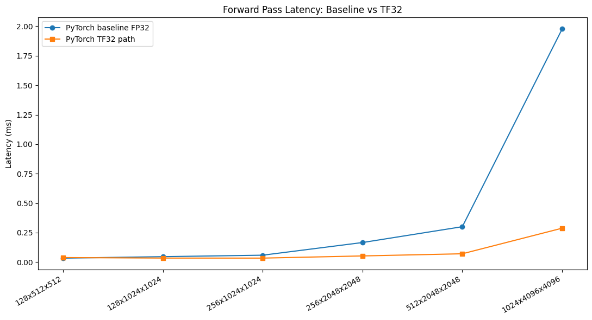
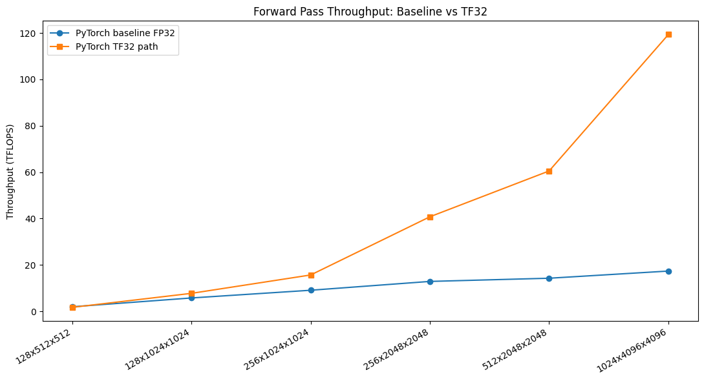
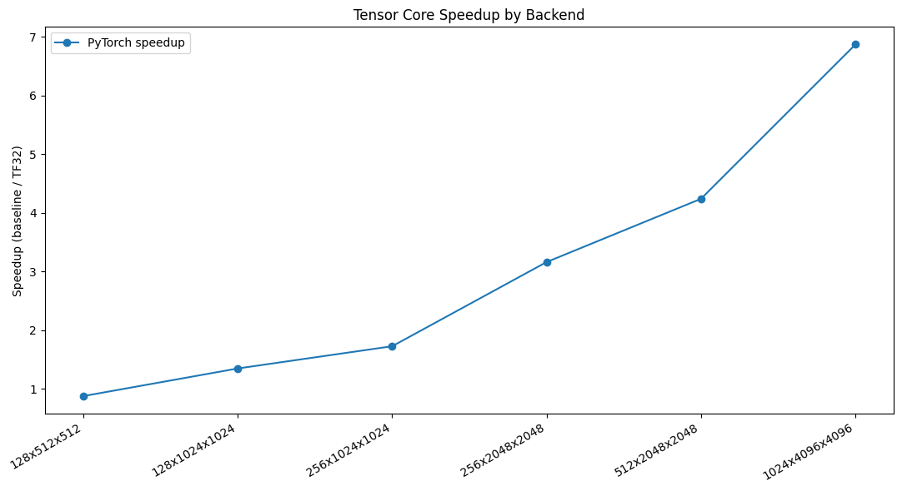

# tensorcore-vs-cudacore

Benchmark and explain the performance gap between:

- Baseline path: FP32 GEMM with TF32 disabled
- Tensor Core path: FP32 input/output with TF32 Tensor Core compute

This repository includes both a PyTorch benchmark and a CUDA C++ cuBLAS benchmark.

## Files

- `pytorch_bench.py`: PyTorch FC forward-pass benchmark (`nn.Linear`, bias disabled)
- `cuda_bench.cu`: CUDA C++ cuBLAS benchmark
	- Baseline: `cublasSgemm` with pedantic math mode
	- Tensor Core path: `cublasGemmEx` with `CUBLAS_COMPUTE_32F_FAST_TF32`
- `plot_results.py`: creates comparison plots from one or both CSV files
- `run_all.py`: optional one-command runner for script-based (non-notebook) workflow
- `colab_benchmark.ipynb`: Colab notebook flow for A100 runtime

## Output CSVs

Both backends use the same schema:

- `B,K,N`
- `baseline_ms`
- `tf32_ms`
- `baseline_tflops`
- `tf32_tflops`
- `speedup` (`baseline_ms / tf32_ms`)

Expected output files:

- `results_pytorch.csv`
- `results_cublas.csv`
- `latency_comparison.png`
- `throughput_comparison.png`
- `speedup_comparison.png`

## Run On Colab (A100)

Primary workflow (self-contained):

1. Open `colab_benchmark.ipynb`.
2. Run cells 1 to 7 in order.

Notes:

- The notebook is self-contained and writes/executes needed benchmark code inside Colab.
- `run_all.py` is optional and intended only for script-based runs outside notebook flow.

## Notes On Benchmarking Correctness

- Warmup iterations are used before measurement.
- GPU timing is done with CUDA events.
- Synchronization is enforced to avoid async timing skew.
- Latency is reported as average milliseconds per forward pass over multiple iterations.
- Throughput is computed as:

$$
\mathrm{TFLOPS} = \frac{2BKN}{t_{sec} \cdot 10^{12}}
$$

## Notebook Output Summary (A100)

The latest notebook run generated these output figures:

- `latency_comparison.png`
- `throughput_comparison.png`
- `speedup_comparison.png`

### Generated Figures

#### Latency Comparison

#### Throughput Comparison

#### Speedup Comparison

Observed PyTorch results from the generated plots:

- Latency (baseline FP32) rises to about 1.98 ms at `(1024, 4096, 4096)`.
- Latency (TF32 path) is about 0.29 ms at `(1024, 4096, 4096)`.
- Throughput improves from about 17 TFLOPS (baseline FP32) to about 120 TFLOPS (TF32 path) at the largest size.
- Speedup ranges from about 0.87x to about 6.9x across the sweep.
- Speedup is below 1x for the smallest size `(128, 512, 512)`, then increases strongly with problem size.

Approximate PyTorch speedup by size from the speedup plot:

- `(128, 512, 512)`: 0.87x
- `(128, 1024, 1024)`: 1.35x
- `(256, 1024, 1024)`: 1.72x
- `(256, 2048, 2048)`: 3.16x
- `(512, 2048, 2048)`: 4.25x
- `(1024, 4096, 4096)`: 6.87x

## Assignment Discussion

1. Goal and setup
- Platform: Colab Pro with NVIDIA A100.
- Workload: FC forward pass GEMM with six `(B, K, N)` sizes.

2. Methods compared
- Mode 1 (CUDA-core baseline): FP32 with TF32 disabled.
- Mode 2 (Tensor Core path): FP32 input/output with TF32-enabled compute.
- Timing method: warmup iterations + CUDA events + synchronization.

3. Why TF32 Tensor Core path is faster
- A100 Tensor Cores deliver much higher matrix throughput than traditional FP32 CUDA-core GEMM for large dense matmuls.
- TF32 preserves FP32 dynamic range while reducing mantissa precision in multiply, which enables Tensor Core acceleration with limited code changes.

4. Why speedup depends on size
- Small matrices are more sensitive to launch overhead and less compute-dense, so Tensor Core benefit can be limited.
- Large matrices have better compute intensity and hardware utilization, so Tensor Core speedup increases significantly.

5. Numerical tradeoff
- TF32 compute is not bit-identical to strict FP32 and may introduce small numerical differences.
- For many deep learning inference/training workloads, the performance gain is often worth this precision tradeoff.

## Submission Checklist

- PyTorch benchmark completed with TF32 off/on comparison.
- cuBLAS benchmark code included (`cublasSgemm` and `cublasGemmEx` TF32 path).
- Warmup + GPU event timing + synchronization used.
- Average latency and TFLOPS computed.
- Comparison plots generated.
- Performance explanation included in this README.

If your instructor requires explicit cuBLAS numeric results in the report body, copy the `results_cublas.csv` values into an additional table below this section.
